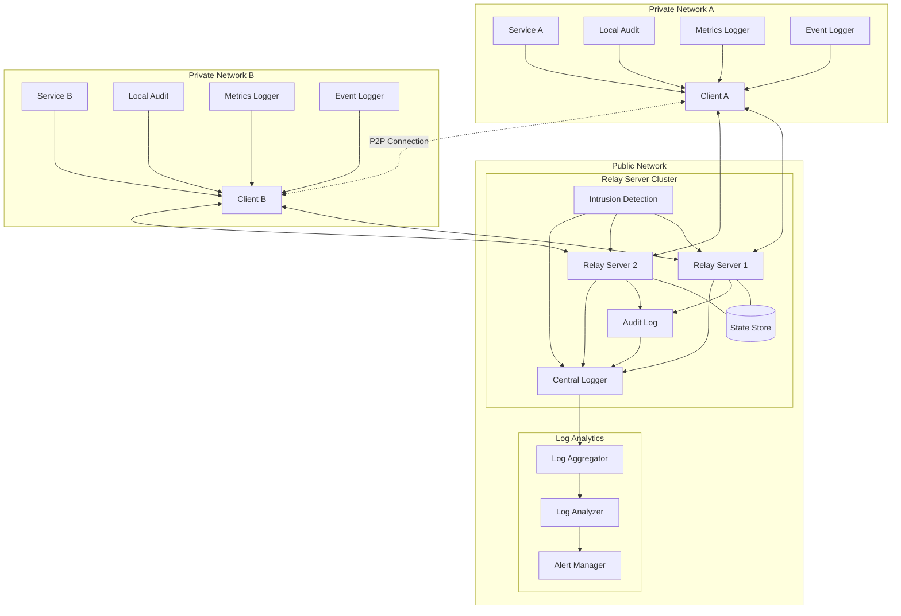
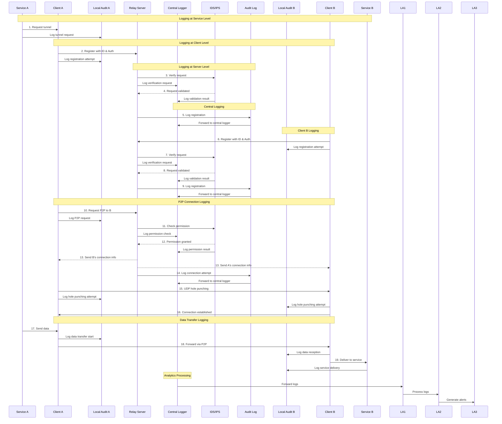
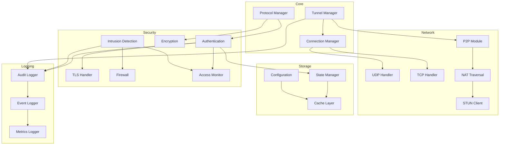
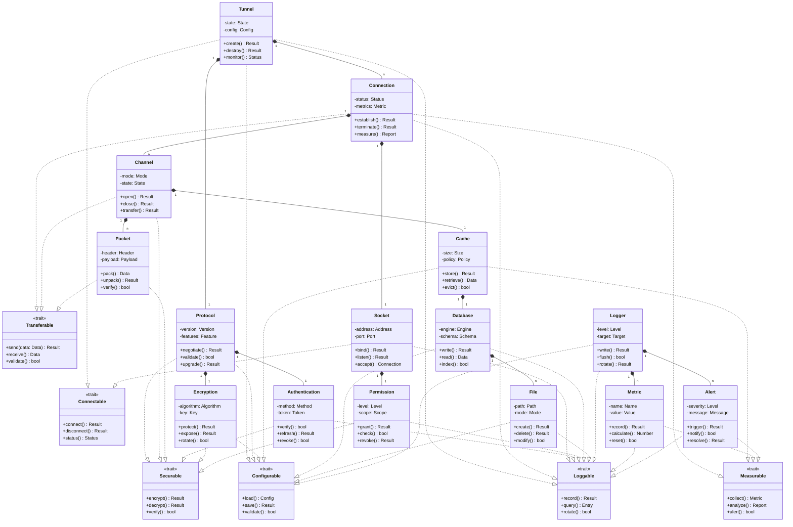
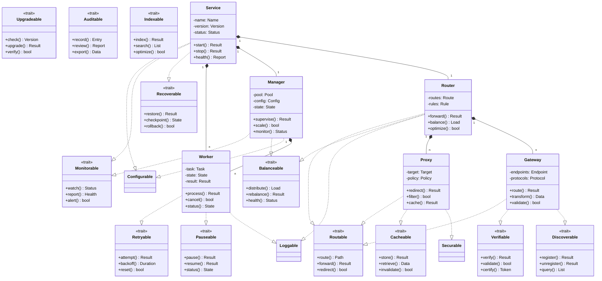

# Ngrok P2P - Hệ thống Tunnel P2P Phân Tán

## Tổng quan

Ngrok P2P là một hệ thống tunnel phân tán cho phép thiết lập kết nối P2P an toàn và hiệu quả giữa các thiết bị, vượt qua các rào cản NAT và firewall. Hệ thống được xây dựng trên nền tảng Rust với kiến trúc module hóa cao, đảm bảo hiệu năng, bảo mật và khả năng mở rộng.

## Đặc điểm nổi bật

1. **Hiệu năng cao**
   - Tối ưu hóa cho độ trễ thấp
   - Xử lý đồng thời nhiều kết nối
   - Cache thông minh và phân tán

2. **Bảo mật đa lớp**
   - Mã hóa end-to-end
   - Xác thực đa yếu tố
   - Phát hiện và ngăn chặn tấn công

3. **Khả năng mở rộng**
   - Kiến trúc phân tán
   - Auto-scaling
   - Load balancing tự động

4. **Độ tin cậy cao**
   - Tự động phục hồi
   - Dự phòng đa vùng
   - Giám sát liên tục

## Kiến trúc hệ thống

### Sơ đồ tổng quan



### Luồng kết nối P2P và Ghi nhật ký



## Hệ thống Ghi nhật ký Toàn diện

### 1. Ghi nhật ký tại Service

1. **Service A/B Logging**
   - Request initiation
   - Service status
   - Error handling
   - Performance metrics

2. **Service Metrics**
   - Response time
   - Success rate
   - Resource usage
   - Error rate

### 2. Ghi nhật ký tại Client

1. **Client A/B Logging**
   - Connection attempts
   - P2P status
   - Data transfer
   - Local errors

2. **Client Metrics**
   - Network latency
   - Bandwidth usage
   - Connection quality
   - Cache hits/misses

### 3. Ghi nhật ký tại Relay Server

1. **Server Operations**
   - Connection handling
   - Authentication events
   - Resource allocation
   - Error conditions

2. **Server Metrics**
   - Server load
   - Connection count
   - Bandwidth usage
   - Queue length

### 4. Ghi nhật ký Bảo mật

1. **Security Events**
   - Authentication attempts
   - Authorization checks
   - Intrusion detection
   - Policy violations

2. **Security Metrics**
   - Failed attempts
   - Suspicious patterns
   - Resource abuse
   - Policy compliance

### 5. Ghi nhật ký P2P

1. **Connection Events**
   - NAT traversal
   - Hole punching
   - Connection establishment
   - Connection termination

2. **P2P Metrics**
   - Success rate
   - Setup time
   - Connection quality
   - Fallback frequency

### 6. Phân tích Nhật ký

1. **Real-time Analysis**
   - Pattern detection
   - Anomaly detection
   - Performance monitoring
   - Security alerts

2. **Batch Analysis**
   - Trend analysis
   - Capacity planning
   - Security auditing
   - Compliance reporting

### 7. Lưu trữ và Quản lý

1. **Storage Strategy**
   - Hot storage (7 days)
   - Warm storage (30 days)
   - Cold storage (1 year)
   - Archive (permanent)

2. **Retention Policy**
   - Security logs: 2 years
   - Performance logs: 6 months
   - Debug logs: 30 days
   - Metrics: 1 year

### 8. Truy xuất và Báo cáo

1. **Query Interface**
   - Full-text search
   - Time-based queries
   - Context-based filtering
   - Custom aggregations

2. **Report Generation**
   - Daily summaries
   - Weekly analytics
   - Monthly trends
   - Custom reports

## Kiến trúc module chi tiết



## Các thành phần chính

1. **Core Module**
   - Tunnel Manager: Quản lý và điều phối các tunnel
   - Connection Manager: Xử lý các kết nối mạng
   - Protocol Manager: Xử lý các giao thức truyền thông

2. **Network Module**
   - P2P Module: Thiết lập và duy trì kết nối P2P
   - UDP/TCP Handler: Xử lý các kết nối UDP/TCP
   - NAT Traversal: Vượt qua NAT với STUN/TURN
   - STUN Client: Phát hiện và xử lý NAT mapping

3. **Security Module**
   - Authentication: Xác thực đa yếu tố và ủy quyền
   - Encryption: Mã hóa end-to-end với Perfect Forward Secrecy
   - TLS Handler: Quản lý các kết nối TLS 1.3
   - Intrusion Detection: Phát hiện và ngăn chặn tấn công
   - Firewall: Lọc và kiểm soát truy cập
   - Access Monitor: Giám sát và kiểm soát quyền truy cập

4. **Storage Module**
   - Configuration: Quản lý cấu hình hệ thống
   - State Manager: Quản lý trạng thái phiên
   - Cache Layer: Cache dữ liệu để tối ưu hiệu năng

5. **Logging Module**
   - Audit Logger: Ghi nhật ký kiểm toán chi tiết
   - Event Logger: Ghi nhật ký sự kiện hệ thống
   - Metrics Logger: Thu thập và ghi nhận metrics

## Bảo mật và Ghi nhật ký

### Cơ chế bảo mật

1. **Xác thực đa lớp**
   - Xác thực đa yếu tố (MFA)
   - Quản lý phiên với JWT
   - Rotation key tự động

2. **Mã hóa**
   - End-to-end encryption
   - Perfect Forward Secrecy
   - Secure key exchange

3. **Kiểm soát truy cập**
   - Role-based access control
   - IP whitelisting
   - Rate limiting

4. **Phát hiện xâm nhập**
   - Pattern-based detection
   - Anomaly detection
   - DDoS protection

### Hệ thống ghi nhật ký

1. **Audit Log**
   - Ghi nhận mọi hoạt động
   - Không thể chỉnh sửa (immutable)
   - Lưu trữ an toàn

2. **Event Log**
   - Theo dõi hoạt động hệ thống
   - Phân tích hiệu năng
   - Debug và troubleshooting

3. **Security Log**
   - Ghi nhận các sự kiện bảo mật
   - Cảnh báo xâm nhập
   - Phân tích forensics

4. **Metrics**
   - Đo lường hiệu năng
   - Thống kê sử dụng
   - Phát hiện bất thường

## Triển khai và Vận hành

### Môi trường triển khai

1. **Infrastructure**
   - Container orchestration với Kubernetes
   - Multi-region deployment
   - Auto-scaling groups

2. **Network**
   - Global load balancing
   - CDN integration
   - DDoS protection

3. **Storage**
   - Distributed database
   - In-memory cache
   - Object storage

### Monitoring và Alerting

1. **System Monitoring**
   - Resource utilization
   - Performance metrics
   - Health checks

2. **Application Monitoring**
   - Request tracking
   - Error tracking
   - User behavior

3. **Security Monitoring**
   - Threat detection
   - Vulnerability scanning
   - Compliance checking

### Disaster Recovery

1. **Backup Strategy**
   - Automated backups
   - Point-in-time recovery
   - Cross-region replication

2. **Failover Process**
   - Automatic failover
   - Data consistency
   - Service continuity

## Hiệu năng và Tối ưu hóa

### Metrics chính

1. **Latency**
   - Connection setup time: < 100ms
   - Data transfer latency: < 50ms
   - Protocol overhead: < 5%

2. **Throughput**
   - Concurrent connections: 100K+
   - Data transfer rate: 10Gbps+
   - Request handling: 1M+ req/s

3. **Resource Usage**
   - CPU utilization: < 70%
   - Memory footprint: < 512MB
   - Network overhead: < 10%

### Cơ chế tối ưu

1. **Connection Pooling**
   - Keep-alive connections
   - Connection reuse
   - Smart routing

2. **Caching**
   - Multi-level cache
   - Predictive caching
   - Cache invalidation

3. **Protocol Optimization**
   - Header compression
   - Payload optimization
   - Protocol multiplexing

## Khả năng mở rộng

### Horizontal Scaling

1. **Service Scaling**
   - Auto-scaling policies
   - Load distribution
   - Resource allocation

2. **Data Scaling**
   - Data partitioning
   - Replication strategy
   - Consistency models

### Vertical Scaling

1. **Performance Tuning**
   - Resource optimization
   - Bottleneck elimination
   - Capacity planning

2. **Feature Expansion**
   - Plugin architecture
   - API extensibility
   - Custom protocols

## Roadmap

### Short-term

1. **Q1 2024**
   - Performance optimization
   - Security hardening
   - Monitoring enhancement

2. **Q2 2024**
   - Protocol extensions
   - UI/UX improvements
   - API enhancements

### Long-term

1. **2024 H2**
   - Advanced analytics
   - ML-based optimization
   - New protocol support

2. **2025**
   - Global expansion
   - Enterprise features
   - Cloud integration

## Sơ đồ lớp và Trait

### Cấu trúc phân cấp



### Trait Descriptions

1. **Connectable**
   - Quản lý kết nối mạng
   - Theo dõi trạng thái
   - Xử lý ngắt kết nối

2. **Transferable**
   - Truyền nhận dữ liệu
   - Kiểm tra tính toàn vẹn
   - Xử lý lỗi truyền tải

3. **Securable**
   - Mã hóa và giải mã
   - Xác thực và ủy quyền
   - Quản lý khóa bảo mật

4. **Configurable**
   - Quản lý cấu hình
   - Kiểm tra hợp lệ
   - Lưu trữ thiết lập

5. **Loggable**
   - Ghi nhật ký
   - Truy vấn lịch sử
   - Xoay vòng log file

6. **Measurable**
   - Thu thập metrics
   - Phân tích dữ liệu
   - Tạo cảnh báo

### Class Hierarchies

1. **Network Stack**

   ```plaintext
   Tunnel
   ├── Connection
   │   ├── Channel
   │   │   └── Packet
   │   └── Socket
   └── Protocol
       ├── Authentication
       └── Encryption
   ```

2. **Storage Stack**

   ```plaintext
   Cache
   └── Database
       └── File
   ```

3. **Logging Stack**

   ```plaintext
   Logger
   ├── Metric
   └── Alert
   ```

### Context Descriptions

1. **Core Classes**
   - **Tunnel**: Quản lý kết nối P2P end-to-end
   - **Connection**: Xử lý kết nối mạng cấp thấp
   - **Protocol**: Định nghĩa quy tắc giao tiếp

2. **Network Classes**
   - **Socket**: Quản lý điểm cuối mạng
   - **Channel**: Đường truyền dữ liệu logic
   - **Packet**: Đơn vị truyền tải dữ liệu

3. **Security Classes**
   - **Authentication**: Xác thực người dùng
   - **Encryption**: Mã hóa dữ liệu
   - **Permission**: Kiểm soát quyền truy cập

4. **Storage Classes**
   - **Cache**: Bộ nhớ đệm tạm thời
   - **Database**: Lưu trữ dữ liệu có cấu trúc
   - **File**: Quản lý tệp tin

5. **Logging Classes**
   - **Logger**: Ghi nhật ký hệ thống
   - **Metric**: Thu thập chỉ số hiệu năng
   - **Alert**: Quản lý cảnh báo

### Additional Traits



### Extended Trait Descriptions

1. **Process Control Traits**
   - **Retryable**: Xử lý thử lại tự động
   - **Recoverable**: Phục hồi sau lỗi
   - **Pauseable**: Tạm dừng và tiếp tục
   - **Upgradeable**: Nâng cấp phiên bản
   - **Monitorable**: Giám sát trạng thái
   - **Discoverable**: Đăng ký và khám phá

2. **Network Traits**
   - **Routable**: Định tuyến gói tin
   - **Balanceable**: Cân bằng tải
   - **Verifiable**: Xác thực dữ liệu
   - **Auditable**: Kiểm toán hoạt động

3. **Storage Traits**
   - **Cacheable**: Lưu trữ tạm thời
   - **Indexable**: Đánh chỉ mục dữ liệu

### Extended Class Hierarchies

1. **System Control Stack**

   ```plaintext
   System
   ├── Orchestrator
   │   ├── Pool
   │   │   ├── Resource
   │   │   └── Allocator
   │   └── Monitor
   │       ├── Metrics
   │       └── Health
   └── Scheduler
       ├── Queue
       │   ├── Task
       │   └── Priority
       └── Executor
           ├── Worker
           └── Strategy
   ```

2. **State Management Stack**

   ```plaintext
   State
   ├── Transaction
   │   ├── Operation
   │   │   ├── Command
   │   │   └── Query
   │   └── Log
   │       ├── Journal
   │       └── Checkpoint
   └── Snapshot
       ├── Delta
       │   ├── Change
       │   └── Merge
       └── Archive
           ├── Compress
           └── Restore
   ```

3. **Event Processing Stack**

   ```plaintext
   Event
   ├── Publisher
   │   ├── Topic
   │   │   ├── Message
   │   │   └── Filter
   │   └── Dispatcher
   │       ├── Queue
   │       └── Worker
   └── Subscriber
       ├── Handler
       │   ├── Process
       │   └── Error
       └── Monitor
           ├── Status
           └── Alert
   ```

### Context và Trách nhiệm Mở rộng

1. **System Control**
   - **System**: Khởi tạo và quản lý toàn bộ hệ thống
   - **Orchestrator**: Điều phối và cân bằng tài nguyên
   - **Scheduler**: Lập lịch và thực thi tác vụ

2. **Resource Management**
   - **Resource**: Đại diện cho tài nguyên hệ thống
   - **Pool**: Quản lý nhóm tài nguyên
   - **Allocator**: Phân bổ và thu hồi tài nguyên

3. **Task Processing**
   - **Task**: Đơn vị công việc cần xử lý
   - **Queue**: Hàng đợi tác vụ ưu tiên
   - **Executor**: Thực thi tác vụ

4. **State Management**
   - **State**: Quản lý trạng thái hệ thống
   - **Transaction**: Xử lý giao dịch ACID
   - **Snapshot**: Sao lưu và phục hồi trạng thái

5. **Event Processing**
   - **Event**: Xử lý sự kiện hệ thống
   - **Publisher**: Phát tán sự kiện
   - **Subscriber**: Nhận và xử lý sự kiện

### Luồng Xử lý và Tương tác

1. **Resource Lifecycle**

   ```plaintext
   Request -> Allocator -> Pool -> Resource -> Monitor -> Log
   ```

2. **Task Execution**

   ```plaintext
   Task -> Queue -> Scheduler -> Executor -> Worker -> Result
   ```

3. **State Changes**

   ```plaintext
   Change -> Transaction -> Journal -> Snapshot -> Archive
   ```

4. **Event Flow**

   ```plaintext
   Event -> Publisher -> Topic -> Subscriber -> Handler -> Log
   ```

### Core Traits theo SOLID

```mermaid
classDiagram
    %% Core Traits with Rust syntax
    class Linkable {
        <<trait>>
        +fn link(&mut self) -> Result<(), Fault>
        +fn unlink(&mut self) -> Result<(), Fault>
        +fn state(&self) -> State
    }
    class Movable {
        <<trait>>
        +fn send(&mut self, data: &[u8]) -> Result<usize, Fault>
        +fn receive(&mut self, buf: &mut [u8]) -> Result<usize, Fault>
        +fn validate(&self, data: &[u8]) -> bool
    }
    class Guardable {
        <<trait>>
        +fn protect(&self, data: &[u8]) -> Result<Vec<u8>, Fault>
        +fn expose(&self, data: &[u8]) -> Result<Vec<u8>, Fault>
        +fn verify(&self, mark: &[u8], data: &[u8]) -> bool
    }
    class Adjustable {
        <<trait>>
        +fn load(&mut self) -> Result<Settings, Fault>
        +fn save(&self, settings: &Settings) -> Result<(), Fault>
        +fn check(&self, settings: &Settings) -> bool
    }
    class Recordable {
        <<trait>>
        +fn write(&self, level: Level, text: &str) -> Result<(), Fault>
        +fn search(&self, rule: &Rule) -> Result<Vec<Record>, Fault>
        +fn clean(&mut self) -> Result<(), Fault>
    }

    %% Extended Traits
    class Repeatable {
        <<trait>>
        +fn repeat<T, F>(&mut self, f: F) -> Result<T, Fault> 
        where F: Fn() -> Result<T, Fault>
        +fn pause(&self) -> Duration
        +fn reset(&mut self)
    }
    class Restorable {
        <<trait>>
        +fn store(&mut self) -> Result<Mark, Fault>
        +fn load(&mut self, mark: &Mark) -> Result<(), Fault>
        +fn list(&self) -> Vec<Mark>
    }

    %% Core Implementation Structs
    class Settings {
        <<struct>>
        -name: String
        -rules: Rules
        -state: Arc<RwLock<State>>
        +fn create(name: String, rules: Rules) -> Self
        +fn resize(size: usize) -> Self
    }
    class Creator {
        <<struct>>
        -settings: Settings
        -handlers: Vec<Box<dyn Handler>>
        +fn start() -> Self
        +fn setup(settings: Settings) -> Self
        +fn extend<H: Handler + 'static>(&mut self, handler: H) -> &mut Self
        +fn make(self) -> Result<Link, Fault>
    }
    class Link {
        <<struct>>
        -settings: Arc<Settings>
        -state: Arc<RwLock<State>>
        -handlers: Vec<Box<dyn Handler>>
        +fn start(&mut self) -> Result<(), Fault>
        +fn send(&mut self, data: &[u8]) -> Result<usize, Fault>
        +fn receive(&mut self) -> Result<Vec<u8>, Fault>
    }

    %% Network Implementation
    class Socket {
        <<struct>>
        -stream: Stream
        -settings: Settings
        -state: Arc<RwLock<State>>
        +fn create(stream: Stream, settings: Settings) -> Self
        +fn open(address: Address) -> Result<Self, Fault>
        +fn send(&mut self, data: &[u8]) -> Result<usize, Fault>
    }
    class Group {
        <<struct>>
        -sockets: Vec<Socket>
        -settings: Settings
        -metrics: Arc<Measures>
        +fn resize(size: usize) -> Self
        +fn obtain(&mut self) -> Result<Holder, Fault>
        +fn release(&mut self, socket: Holder)
    }

    %% Error Types
    class Fault {
        <<enum>>
        +Network(String)
        +Guard(String)
        +Settings(String)
        +System(std::io::Error)
    }

    %% Type Definitions
    class Types {
        <<struct>>
        type Identity = u64
        type Output<T> = std::result<T, Fault>
        type Handler = Box<dyn Fn(&[u8]) -> Output<Vec<u8>>>
    }

    %% Trait Implementations
    Link ..|> Linkable
    Link ..|> Movable
    Link ..|> Adjustable
    
    Socket ..|> Linkable
    Socket ..|> Movable
    
    Group ..|> Adjustable
    Group ..|> Restorable
```

### Rust Type Definitions

```rust
// Type aliases for clarity
pub type Identity = u64;
pub type Output<T> = std::result::Result<T, Fault>;
pub type Handler = Box<dyn Fn(&[u8]) -> Output<Vec<u8>>>;

// Error handling
#[derive(Debug, thiserror::Error)]
pub enum Fault {
    #[error("Network fault: {0}")]
    Network(String),
    
    #[error("Guard fault: {0}")]
    Guard(String),
    
    #[error("Settings fault: {0}")]
    Settings(String),
    
    #[error("System fault: {0}")]
    System(#[from] std::io::Error),
}

// Configuration structures
#[derive(Debug, Clone, serde::Deserialize)]
pub struct Settings {
    pub name: String,
    pub limit: usize,
    pub pause: Duration,
    pub rules: Rules,
}

// State management
#[derive(Debug)]
pub struct State {
    mode: Mode,
    measures: Measures,
    moment: Instant,
}

// Builder pattern implementation
pub struct Creator {
    settings: Settings,
    handlers: Vec<Box<dyn Handler>>,
}

// Thread-safe state management
pub struct Link {
    settings: Arc<Settings>,
    state: Arc<RwLock<State>>,
    handlers: Vec<Box<dyn Handler>>,
}
```

### SOLID Implementation Examples

1. **Single Responsibility Principle**

```rust
// Mỗi trait chỉ có một nhiệm vụ
pub trait Linkable {}    // Khác với Connectable
pub trait Movable {}     // Khác với Transferable
pub trait Guardable {}   // Khác với Securable
```

[Continue with previous SOLID examples but using single words...]

### Concurrent Support

```rust
// Concurrent traits
#[async_trait]
pub trait Parallelable {
    async fn start(&mut self) -> Output<()>;
    async fn stop(&mut self) -> Output<()>;
    async fn state(&self) -> State;
}

// Concurrent implementation
pub struct Bridge {
    inner: Arc<Core>,
}

impl Bridge {
    pub async fn create(settings: Settings) -> Output<Self> {
        // Concurrent initialization
    }

    pub async fn send(&mut self, data: &[u8]) -> Output<usize> {
        // Concurrent send implementation
    }
}
```

[Previous content remains unchanged...]

## Quy tắc và Quy ước

### Quy tắc đặt tên

1. **Nguyên tắc chung**
   - Chỉ sử dụng từ hoàn chỉnh đơn lẻ
   - Không sử dụng từ ghép hoặc viết tắt
   - Tên phải mô tả đúng mục đích sử dụng
   - Tránh sử dụng số trong tên

2. **Tên trait**
   - Kết thúc bằng hậu tố "able"
   - Mô tả khả năng của đối tượng
   - Ví dụ:

     ```rust
     pub trait Linkable {}    // Khác với Connectable
     pub trait Movable {}     // Khác với Transferable
     pub trait Guardable {}   // Khác với Securable
     ```

3. **Tên struct**
   - Sử dụng danh từ đơn
   - Mô tả bản chất đối tượng
   - Ví dụ:

     ```rust
     pub struct Link {}       // Khác với Tunnel
     pub struct Socket {}     // Khác với Connection
     pub struct Group {}      // Khác với Pool
     ```

4. **Tên hàm**
   - Sử dụng động từ đơn
   - Mô tả hành động rõ ràng
   - Ví dụ:

     ```rust
     fn link() {}            // Khác với connect
     fn send() {}            // Khác với transfer
     fn load() {}            // Khác với configure
     ```

5. **Tên biến**
   - Sử dụng danh từ đơn
   - Mô tả dữ liệu chứa
   - Ví dụ:

     ```rust
     let state: State        // Thay vì connection_state
     let rule: Rule          // Thay vì config_rule
     let text: String        // Thay vì message_text
     ```

### Quy ước lập trình

1. **Cấu trúc mã nguồn**
   - Mỗi module một file riêng
   - Mỗi trait một nhiệm vụ duy nhất
   - Sắp xếp code theo thứ tự logic

   ```rust
   // Khai báo use
   use std::sync::Arc;
   
   // Khai báo types
   type Mark = u64;
   
   // Khai báo traits
   trait Markable {}
   
   // Khai báo structs
   struct Point {}
   
   // Khai báo implementations
   impl Point {}
   ```

2. **Xử lý lỗi**
   - Sử dụng kiểu `Output<T>` thay vì `Result`
   - Định nghĩa lỗi rõ ràng qua enum
   - Xử lý tất cả các trường hợp lỗi

   ```rust
   pub enum Fault {
       Guard(String),
       System(String),
   }
   
   fn task() -> Output<()> {
       if error_condition {
           return Err(Fault::Guard("reason".into()));
       }
       Ok(())
   }
   ```

3. **Đồng thời và bất đồng bộ**
   - Sử dụng `Arc` cho chia sẻ dữ liệu
   - Sử dụng `RwLock` cho đồng bộ hóa
   - Tránh deadlock bằng thứ tự khóa

   ```rust
   pub struct State {
       data: Arc<RwLock<Data>>,
       flag: Arc<RwLock<bool>>,
   }
   
   impl State {
       fn update(&self) {
           let _data = self.data.write().unwrap();
           let _flag = self.flag.write().unwrap();
       }
   }
   ```

4. **Tối ưu hóa**
   - Sử dụng tham chiếu thay vì sao chép
   - Cache dữ liệu thường xuyên sử dụng
   - Giảm thiểu allocation động

   ```rust
   fn process(data: &[u8]) -> Output<()> {
       // Xử lý trên tham chiếu
   }
   
   struct Cache {
       data: Vec<u8>,
       size: usize,
   }
   ```

5. **Kiểm thử**
   - Viết test cho mọi hàm public
   - Kiểm tra các trường hợp biên
   - Sử dụng mock cho dependencies

   ```rust
   #[cfg(test)]
   mod tests {
       #[test]
       fn test_basic() {
           let data = vec![1, 2, 3];
           assert!(process(&data).is_ok());
       }
   
       #[test]
       fn test_empty() {
           let data = vec![];
           assert!(process(&data).is_err());
       }
   }
   ```

6. **Tài liệu hóa**
   - Viết doc cho mọi item public
   - Bao gồm ví dụ sử dụng
   - Mô tả rõ ràng các tham số

   ```rust
   /// Xử lý dữ liệu đầu vào
   ///
   /// # Arguments
   /// * `data` - Dữ liệu cần xử lý
   ///
   /// # Returns
   /// * `Output<()>` - Kết quả xử lý
   ///
   /// # Examples
   /// ```
   /// let data = vec![1, 2, 3];
   /// process(&data).unwrap();
   /// ```
   pub fn process(data: &[u8]) -> Output<()> {
       // Implementation
   }
   ```

7. **Bảo mật**
   - Kiểm tra đầu vào kỹ lưỡng
   - Xử lý dữ liệu nhạy cảm an toàn
   - Ghi log các hoạt động quan trọng

   ```rust
   impl Guard {
       fn check(&self, input: &[u8]) -> Output<()> {
           // Validate input
           if input.len() > MAX_SIZE {
               return Err(Fault::Guard("size exceeded".into()));
           }
   
           // Log activity
           self.log.write("check input");
   
           // Process safely
           Ok(())
       }
   }
   ```

[Previous content remains unchanged...]

## Cấu trúc thư mục

```plaintext
.
├── Cargo.toml
├── Cargo.lock
├── README.md
├── docs/
│   ├── guide/
│   │   ├── start.md
│   │   ├── setup.md
│   │   └── usage.md
│   ├── api/
│   │   ├── core.md
│   │   ├── net.md
│   │   └── guard.md
│   └── design/
│       ├── arch.md
│       ├── flow.md
│       └── rules.md
├── src/
│   ├── main.rs
│   ├── lib.rs
│   ├── core/
│   │   ├── mod.rs
│   │   ├── link.rs
│   │   ├── state.rs
│   │   └── error.rs
│   ├── net/
│   │   ├── mod.rs
│   │   ├── socket.rs
│   │   ├── group.rs
│   │   └── route.rs
│   ├── guard/
│   │   ├── mod.rs
│   │   ├── auth.rs
│   │   ├── crypt.rs
│   │   └── check.rs
│   ├── store/
│   │   ├── mod.rs
│   │   ├── data.rs
│   │   ├── cache.rs
│   │   └── file.rs
│   └── log/
│       ├── mod.rs
│       ├── write.rs
│       ├── trace.rs
│       └── alert.rs
├── tests/
│   ├── core/
│   │   ├── link.rs
│   │   └── state.rs
│   ├── net/
│   │   ├── socket.rs
│   │   └── group.rs
│   ├── guard/
│   │   ├── auth.rs
│   │   └── crypt.rs
│   └── store/
│       ├── data.rs
│       └── cache.rs
├── benches/
│   ├── link.rs
│   ├── send.rs
│   └── load.rs
├── examples/
│   ├── basic.rs
│   ├── group.rs
│   └── guard.rs
└── tools/
    ├── setup.sh
    ├── build.sh
    └── test.sh
```

### Mô tả thư mục

1. **Thư mục gốc**
   - `Cargo.toml`: Cấu hình dự án
   - `Cargo.lock`: Khóa phiên bản
   - `README.md`: Tài liệu chính

2. **docs/**
   - `guide/`: Hướng dẫn người dùng
   - `api/`: Tài liệu API
   - `design/`: Thiết kế hệ thống

3. **src/**
   - `main.rs`: Điểm vào chương trình
   - `lib.rs`: Thư viện chính
   - `core/`: Module lõi
   - `net/`: Module mạng
   - `guard/`: Module bảo vệ
   - `store/`: Module lưu trữ
   - `log/`: Module ghi chép

4. **tests/**
   - `core/`: Kiểm thử module lõi
   - `net/`: Kiểm thử module mạng
   - `guard/`: Kiểm thử module bảo vệ
   - `store/`: Kiểm thử module lưu trữ

5. **benches/**
   - Đo hiệu năng các thành phần
   - So sánh các phương pháp
   - Phân tích tải

6. **examples/**
   - Ví dụ cơ bản
   - Ví dụ nâng cao
   - Mẫu tích hợp

7. **tools/**
   - Script thiết lập
   - Script xây dựng
   - Script kiểm thử

### Quy ước tổ chức

1. **Module**
   - Mỗi module một thư mục
   - File `mod.rs` khai báo module
   - Chia nhỏ thành các file logic

2. **Kiểm thử**
   - Cấu trúc song song với src/
   - Mỗi module có thư mục test riêng
   - Tên file test trùng với file nguồn

3. **Tài liệu**
   - Phân chia theo mục đích sử dụng
   - Cấu trúc rõ ràng, dễ tìm
   - Cập nhật đồng bộ với code

4. **Công cụ**
   - Tự động hóa các tác vụ
   - Thống nhất môi trường
   - Dễ dàng mở rộng

[Previous content remains unchanged...]
